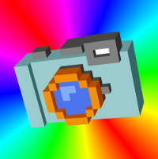
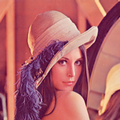

# Introduction

PhotoBox uses a handful of resources to generate images that suit your needs.

All examples will use the following:

For text examples, it will use the phrase `this is a great example`